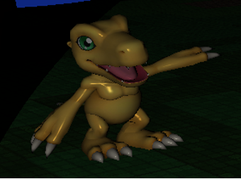

## OpenGL Interactive Animated 3D Scene

### Introduction

I chose to implement this scene because I have always liked the Digimon franchise as it is quite interesting and technologically oriented. I was inspired by the game Digimon World for the Play Station 1 which was first released in Japan in 1999 then the U.S. and Europe in 2000 and 2001 respectively.

The scene shows an island with a stadium this is where tournaments take place the stadium is rotating around the island to show that the tournament has been won.
There is a podium in the center of the island with the two victorious Digimon standing on it in a fight position.
There are also two smaller Digimon pointing at the podium while standing on the grass of the island.
Finally there are also two palm trees on the island which can twirl around with user input.

All models used are free for use for non-commercial purposes.

### TR 1 – 3D Modelling & 3D Transformations

**Object 1 3D Modelling**

  

```cpp
COMP3011_ASSESSMENT_3.cpp
Line:
std::pair<float *, unsigned int> pair_podium = parse_OBJ("textures/podium.obj");
float *vertices_podium = pair_podium.first;
```

This object is of a podium where objects of two other Digimon have also been placed.

**Object 1 3D Transformations**

  

```cpp
COMP3011_ASSESSMENT_3.cpp
Line:
model_podium = glm::rotate(model_podium, glm::radians(45.f), glm::vec3(0.0f, 1.0f, 0.0f));
model_podium = glm::scale(model_podium, glm::vec3(0.4f, 0.4f, 0.4f));
```

The object has been transformed through scaling down as well as rotation on the y-axis.

**Object 2 3D Modelling**

  

```cpp
COMP3011_ASSESSMENT_3.cpp
Line:
std::pair<float *, unsigned int> pair_agumon = parse_OBJ("textures/agumon.obj");
float *vertices_agumon = pair_agumon.first;
```

The object is a model of the Digimon known as Agumon.

**Object 2 3D Transformations**

  

```cpp
COMP3011_ASSESSMENT_3.cpp
Line:
model_agumon = glm::rotate(model_agumon, glm::radians(270.f), glm::vec3(0.0f, 1.0f, 0.0f));
model_agumon = glm::scale(model_agumon, glm::vec3(0.6f, 0.6f, 0.6f));
```

Transformations have been made such as translating the object to the correct position along with rotation to give the correct orientation pointing toward the podium, as well as scaling down.

**Object 3 3D Modelling**

  

```cpp
COMP3011_ASSESSMENT_3.cpp
Line:
std::pair<float *, unsigned int> pair_gabumon = parse_OBJ("textures/gabumon.obj");
float *vertices_gabumon = pair_gabumon.first;
```

The object is a model of the Digimon known as Gabumon.

**Object 3 3D Transformations**

  

```cpp
COMP3011_ASSESSMENT_3.cpp
Line:
model_gabumon = glm::translate(model_gabumon, glm::vec3(-1.25f, 0.0f, 0.0f));
model_gabumon = glm::rotate(model_gabumon, glm::radians(180.f), glm::vec3(0.0f, 1.0f, 0.0f));
```

Transformations have been made similar to the previous object such as translating the object to the correct position, rotating to give the correct orientation pointing toward the podium, and scaling to reduce the overall size of the object.

### TR 1 – 3D Modelling & 3D Transformations (OBJ Parser)

To read the contents of the OBJ file, I use a while loop with the `fscanf()` function. The values from each line go into their own vector depending on if it is a `v`, `vt`, `vn`, or `f` line. These correspond to vertex position, vertex texture, vertex normal, and the face indices. 

The vertex positions and vertex normals use the `glm::vec3`, the vertex textures use `glm::vec2`, and the face indices are stored as unsigned integers in three separate vectors for position, texture, and normals.

To process the data, I iterate through each of the vertex positions, textures, and normals for each triangle (each face line with a “f”) and use the indices in the face vectors to store the correct value in the corresponding vector. Since C indexing starts at 0 and OBJ indexing starts at 1, I negate the index by 1.

To transfer the vertex attributes from each of the vectors into an array that OpenGL uses, I use `malloc` to create the array, then I use an outer while loop with three separate inner loops for the positions, textures, and normals, appending to the array all the values in the correct order.

This array is then transferred to the main function as a pair with the triangle number and the array is freed at the end of the program.

### TR 2 - Animation

  

```cpp
COMP3011_ASSESSMENT_3.cpp
Line:
model_stadium = glm::rotate(model_stadium, (float)glfwGetTime() / 4, glm::vec3(0.0f, 1.0f, 0.0f));
```

The animation is of the stadium rotation around the island. This is to signify that the tournament has been won.

### TR 3 – Lighting

**Light 1**

  

```cpp
COMP3011_ASSESSMENT_3.cpp
Line:
glm::vec3 lightDirection = glm::vec3(0.0f, -1.0f, 0.0f);
glm::vec3 lightPos = glm::vec3(0.f, 4.f, 0.f);
```

Spotlight which follows the camera when a certain key is pressed.

**Light 2**

  

```cpp
COMP3011_ASSESSMENT_3.cpp
Line:
glUniform3f(
glGetUniformLocation(
shaderProgram, "lightColor"), 1.0f, 1.0f, 1.0f);
```

Directional Light Downwards to illuminate the scene.

### TR 4 – Texture

**Texture 1**

  

```cpp
COMP3011_ASSESSMENT_3.cpp
Line:
GLuint texture_island = setup_texture(
               "textures/island.bmp");
```

This is the texture of the main island. It is mapped to the entire top surface.

Mipmaps have also been used with this particular texture.

**Texture 2**

  

```cpp
COMP3011_ASSESSMENT_3.cpp
Line:
GLuint texture_stadium = setup_texture(
               "textures/stadium.bmp");
```

The stadium also has a texture applied to it which is wrapped around the sides as well as on the top.

### TR 5 - Interactive Camera

  

```cpp
COMP3011_ASSESSMENT_3.cpp
Line:
SCamera Camera;
InitCamera(Camera, 45, -15);
OrientCamera(Camera, 0, 0);
```

A fly-through camera has been implemented to make the scene more immersive than would otherwise be possible. This is done alongside a Model Viewer Camera. The two cameras can be toggled by pressing the “M” key.

### TR 5 - Secondary Camera

  

```cpp
COMP3011_ASSESSMENT_3.cpp
Line:
SCamera Camera;
```

A separate model viewer camera has been implemented so as to give an overall view of the main island. The two cameras can be toggled by pressing the “M” key.

### TR 6 - Interaction with the Scene

**TR 6 - Interactive Object**

  

```cpp
COMP3011_ASSESSMENT_3.cpp
Line:
float y_rotation_angle = 0;
model_tree_2 = glm::rotate(model_tree_2, glm::radians(y_rotation_angle), glm::vec3(0.0f, 1.0f, 0.0f));
```

There are two objects that are interactive; both are the trees. With either the Left Arrow or Right Arrow Buttons, the trees will twirl on the spot in different directions based on which arrow button was pressed.

**TR 6 - Interactive Light**

  

```cpp
COMP3011_ASSESSMENT_3.cpp
Line:
lightDirection = Camera.Front;
lightPos = Camera.Position;
```

The light is an interactive spotlight which adjusts itself to the camera position when the “L” button is hit.

### Conclusion

In my opinion, I believe that the scene turned out quite well.
The strengths are that the scene has a good texture and lighting implementation; also all the objects in the scene all fit into the same theme which is good for uniformity.
The weaknesses of the scene are that it can be quite dark in some places, and I could have added some of the hand-drawn 3D objects I made which may make the scene more unique.

I am particularly proud of the fact that my OBJ parser is implemented in quite an efficient way and is able to parse very large OBJ files almost instantaneously. Also, I am proud of the fact that the textures and lighting work seamlessly with one another making viewing the scene a pleasant experience.

In terms of areas for improvement, I would implement a skybox for the scene as I think this could make it look a lot better and tie all the parts of the scene together quite well. To add to this, to ensure parts of the scene aren't dark where they shouldn't be, I would implement further positional lighting in certain areas to create a nice effect.

Through doing this assignment of the Computer Graphics course, I have learned how to build a basic but feature-rich 3D graphics renderer. I have also learned the inner workings of how lighting is calculated and the way in which different objects interact with this light. I also improved my C Programming knowledge with bits of C++ as well, especially while making the OBJ parser.

For the future, I definitely want to try and apply my new knowledge of lighting to develop and render more photo-realistic 3D graphics scenes.